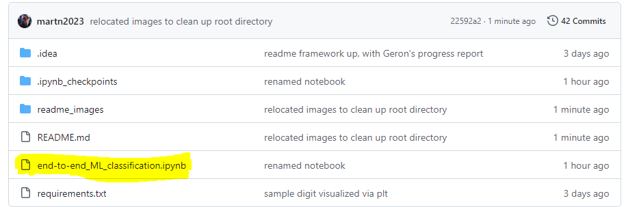

# I. Author's Context:
I've held leadership roles in numerous VC-backed tech startups, but:
  - they were all __business__ roles (finance, COO, product)
  - I have no CS degree
  - have never undergone a coding bootcamp
  
  
After building some CRUD web apps and ETL pipelines, I'm upskilling in __Applied ML Engineering__.

- An ex-Google dev showed me an industry standard ML book [Hands-On Machine Learning with Scikit-Learn, Keras, and TensorFlow](https://www.amazon.com/Hands-Machine-Learning-Scikit-Learn-TensorFlow/dp/1492032646) by Aurelien Geron:

| CHAPTER | FOUNDATIONAL PROJECT         | TECH/MODEL USED                   | STATUS                  |
|---------|------------------------------|-----------------------------------|-------------------------|
| 2       | Predicting housing prices    | Supervised Learning, Regression   | **Completed/published** |
| 3       | Handwritten digits           | Image classification              | ** **This project** **  |
| 4       | Training models              | Supervised Learning               | Not Started             |
| 5       | Classifying data points      | Support Vector Machines (SVM)     | Not Started             |
| 6       | Tree-based models            | Decision Trees, Random Forests    | Not Started             |
| 7       | Combining models             | Ensemble Learning                 | Not Started             |
| 8       | Reducing dataset complexity  | Dimensionality Reduction          | Not Started             |
| 9       | Grouping similar data points | Clustering, Unsupervised Learning | Not Started             |
| 10      | Building neural networks     | Neural Networks, Deep Learning    | Not Started             |
 
 

# II. How to use this:
Screenshots below are illustrative, not comprehensive. __For a deeper dive into the analysis, see highlighted Jupyter notebook__.

 
 

# III. Project Overview:
#### Stage 1: "Is it a 5 or not?"
This project is about classifying images of handwritten numbers. Straight out of that [comedy show about startups](https://www.youtube.com/watch?v=ACmydtFDTGs&ab_channel=HBO) where the food-classification phone app can only see whether a meal is a hot dog or not.

 
 
 
#### Stage 2: How do I trade off between precision(quality) and recall(quantity)?

 
 
 
#### Stage 3: Should I use SGD or Random Forest?

 
 
 

 
 
#### Stage 4: Evaluating Random Forest model 
1st chart shows mostly accurate classification... 

 
 
...but when we zoom in, it shows that 8's are causing the most confusion 

 
 
 
#### Stage 5: Final model hits goal of 97% accuracy, precision, and recall!
Applied generalized learnings from training on the first 60,000 images onto the testing data (remaining 10,000 images) 

 
 
 
# IV. Challenges, Tradeoffs and Considerations:
#### Re-combine raw data?
MINST offers 70K images, but these are pre-split into 60K training and 10K testing. My kneejerk reaction was to combine these 2 and re-shuffle them to "simulate the real world", where there's no reasonable expectation of getting data curated for you at the start. I reluctantly withdrew my objection because doing would increase inconsistencies from a mountain of existing literature on this table-stakes exercise, and I didn't want to get stuck trying to figure out if any deltas were due to error vs the fact I recombined test data at the start.

#### Gradient Descent strategy?
The most accurate way to drive a car is to memorize a 300-mile route in your head (full bath gradient descent). But in real life, it might be better to just make decisions based on what you see 400 feet ahead of you (stochastic gradient descent). It'll be less accurate, but you won't be limited memory capacity and you'll know if you're going in the generally correct direction after a few moves.

#### Data extraction method
I wanted to manually browse Kaggle to ensure I had the latest version, and then manually download. Ended up pulling a specific data set name in the textbook to avoid inconsistencies and leverage automation.

# V. Major Learnings:
#### Kaggle
Kaggle the LeetCode of ML, web site that has data sets and challenges you can work on, either untimed or in timed competitions. 

#### Precision vs. Recall
Understanding what they are, and the natural tension between the 2 that forces the data scientist to make a tradeoff.

# VI. Potential improvements:
The purpose of this exercise was to do a quick proof-of-concept on classification. That being said, here are some ideas.
#### Product/UI
- The image-reading was thrown off by the fact that not all numbers were centered evenly or rotated. We could create 4 derivative images where we shift each number up/down/left/right 1 pixel, insert those 4 newly-formed images into the training data, and work from there
- This was image classification. I'd be interested in something like spam detection (covered 3 chapters later) 

#### Tools
- Will step up to Seaborn for data visuzalization after getting more comfortable with Matplotlib
